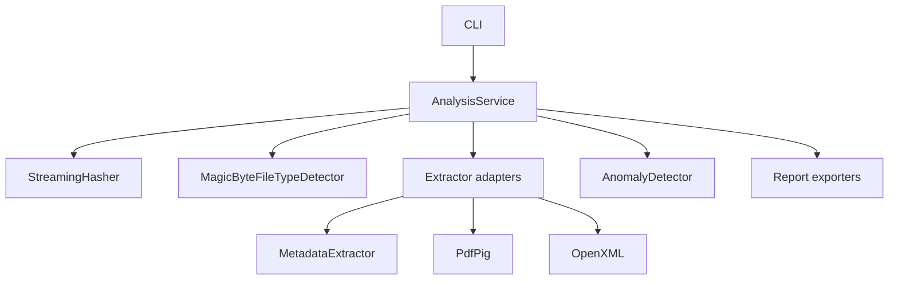

# Architecture

Core owns immutable domain records, interfaces, hashing, detection, parser adapters, anomaly detection, orchestration, serialization, and exporters. The CLI owns argument parsing, presentation, logging, and exit codes. Third-party library types remain in Core adapter implementations and do not cross the domain contracts.

Bounded batch concurrency uses a semaphore and supports cancellation. Output paths must be selected outside evidence directories. Future work includes richer format validation, a durable custody ledger, configurable timestamp policies, and broader test fixtures.