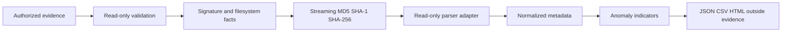

# Forensic Methodology

The tool validates paths, gathers filesystem facts, detects signatures, hashes the original with streaming reads, reopens a read-only stream for parsing, normalizes metadata, detects indicators, and exports a custody-linked report. Evidence files are never executed, modified, or written beside. Filesystem timestamp precision and semantics vary by OS and filesystem; timestamp mismatches require investigation and are not proof of tampering.

Expected parser failures become `METADATA_PARSE_FAILURE` anomalies with partial results. `INVALID_GPS`, `FUTURE_TIMESTAMP`, `EXTENSION_MISMATCH`, `DUPLICATE_HASH`, `EMPTY_FILE`, and `UNSUPPORTED_FORMAT` are indicators. Reports should be preserved with the original SHA-256 and analyst context.

